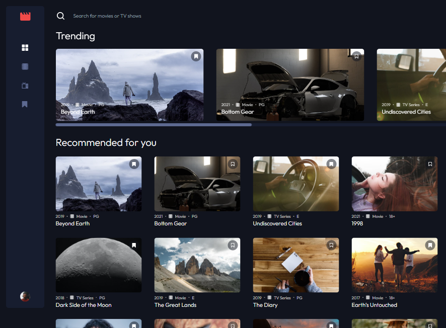

# Entertainment web

This is a solution to the [Entertainment web app challenge on Frontend Mentor](https://www.frontendmentor.io/challenges/entertainment-web-app-J-UhgAW1X). Frontend Mentor challenges help you improve your coding skills by building realistic project.

## Table of contents

- [Overview](#overview)
  - [The challenge](#the-challenge)
  - [Screenshot](#screenshot)
  - [Links](#links)
- [My process](#my-process)
  - [Built with](#built-with)
  - [What I learned](#what-i-learned)
  - [Continued development](#continued-development)
  - [Useful resources](#useful-resources)
- [Author](#author)

## Overview

### The challenge

Users should be able to:

- View the optimal layout for the app depending on their device's screen size
- See hover states for all interactive elements on the page
- Navigate between Home, Movies, TV Series, and Bookmarked Shows pages
- Add/Remove bookmarks from all movies and TV series
- Search for relevant shows on all pages

### Desktop Screenshot



### Links

LINKS TO BE ADDED!

- Solution URL: [Fontend Mentor Solution Page](https://www.frontendmentor.io/solutions/entertainment-web-app-74jjvxiPcP)
- Live Site URL: [Thats Entertainment](https://thats-entertainment-v1.netlify.app)

## My process

### Built with

- Semantic HTML5 markup
- Flexbox
- CSS Grid
- Mobile-first workflow
- [SASS/SCSS](https://sass-lang.com) - CSS preprocessor / CSS extension
- [Tailwind CSS](https://tailwindcss.com) - CSS Utility class library
- [React](https://reactjs.org/) - JS library
- [React Redux-Toolkit](https://redux-toolkit.js.org) - State management library
- [React-Router-6](https://reactrouter.com/en/main) - library for routing & navigation
- [Redux-persist](https://github.com/rt2zz/redux-persist) - Saves and hydrates the state to local storage
- [Axios](https://axios-http.com) - http based promise library to help interact with APIs
- [Json-server](https://github.com/typicode/json-server) - Mock API server and database to get APIs from


### What I learned

There were a few things I learned when building this project. One was planning, I had always planned the styles and layout of my projects before starting a project abd this has enabled me to build the UI of the projects much quicker. Although, in this project was the first time I had applied the same concept to the features, logic and flow of the project. I found this had the same outcome and enabled me to build the project alot faster and more effeciently.

Another takeaway from this project for me was getting more comfortable with the grid, little things like the difference between "auto-fill" & "auto-fit" when creating responsive grids. For example, auto-fill will allow another columns to be added to the end, when there is enough space but won't stretch the content, where as auto-fit will stretch the content to cover the space, untill there is enough room for another column.

Although the main things I have learned from this project was using "Json-server" to set up a mock backend server, on the localhost, and creating a database and API I could interact with. I would then use this API to fetch the data that I needed for the project. I also used this and "Json-server-auth" to create a auth signup/login functionality for the user, using different API calls like patch and post, while also using a json web token to authorize the user when changing specific data like a users bookmarks. 

I used this in combination with creating private routes in react-router and only directing the user from the login/signup page, to the dashboard after the user has been authenticated.

Although because I had used a mock backend with json-server & json-server-auth I wasn't able to deploy this project as it needed a external server to host the database and API while also allowing authentication, I was able to find one alternative but this only worked with hosting the Database and API but not the authentication which is why this version has no signup/login functionality at the moment.


While developing I had to set up a local server and make calls to grab the data from it.

### This was the cmd to set up the local mock server.
```json 
"start-server": "json-server -p 3006 -w ./src/database/db.json",
```

### This is the API call to the local server.
```js
export const getContent = createAsyncThunk("content/getContent", async () => {
  try {
    const res = await axios.get("http://localhost:3006/content");
    return res.data;
  } catch (error) {
    console.error(error);
    return error;
  }
});
```

### Continued development

Using a mock backend on this project has definitely sparked my interest about learning more about the backend and creating APIs and how to create things like authentication and interacting with a database & server. I will be learning more about this in the near future so I can start building full stack applications. Once I learn more about it, I will return to this project and finally implement the authentication and the signup/login features for the project.

### Useful resources

- [ikramdeveloper repo on deploying Json-server](https://github.com/ikramdeveloper/json-server-deploy) - I found this when searching for how to deploy json-server on stackoverflow and found it to be very helpfull, I used the glitch solution.

## Author

- Website - [David Henery](https://www.djhwebdevelopment.com)
- Frontend Mentor - [@David-Henery4](https://www.frontendmentor.io/profile/David-Henery4)
- linkedIn - [David Henery](https://www.linkedin.com/in/david-henery-725458241)


